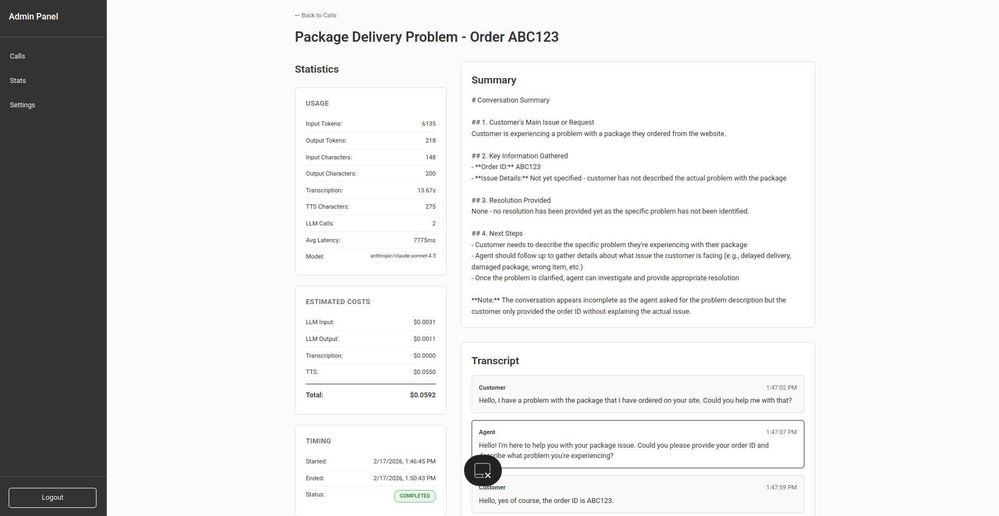
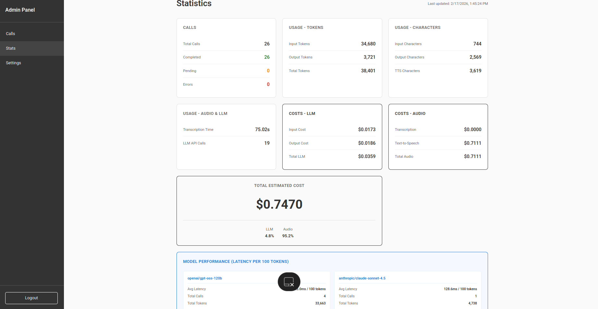
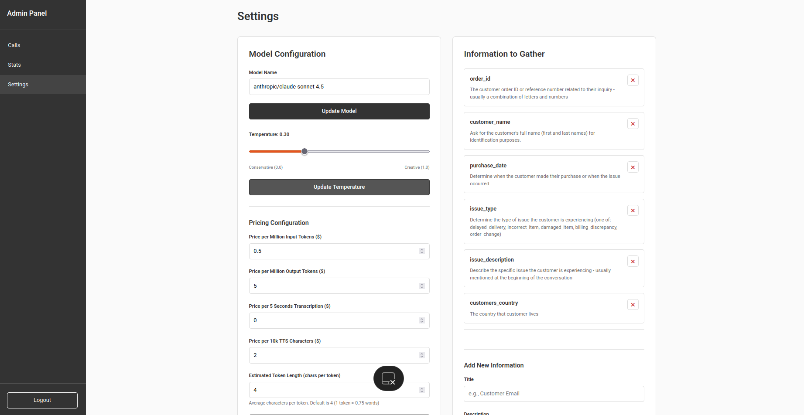
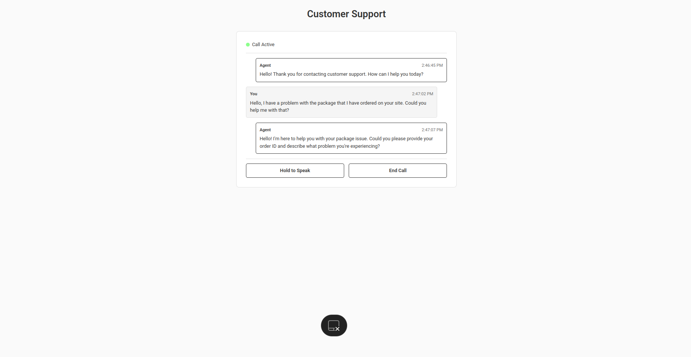

# Best Voice Agent 🎙️

> **Enterprise-grade AI voice assistant for real-time customer support with comprehensive observability and analytics**

A production-ready, scalable voice AI agent that handles multiple concurrent conversations with advanced monitoring, cost tracking, and easy deployment via Docker Compose.

---

## ✨ Key Features

### 🌍 **Multi-Language Support**
Supports conversations in multiple languages out of the box - the agent automatically adapts to the user's language using advanced LLM capabilities.

### ⚡ **Asynchronous Architecture**
- **Concurrent Call Handling**: Backend built with FastAPI's async framework to handle multiple simultaneous conversations
- **Non-blocking Operations**: All I/O operations (LLM calls, TTS, transcription) run asynchronously
- **Scalable Design**: Ready for high-volume production deployments

### 🚀 **Blazing Fast Performance**
- **Groq Integration**: Leverages ultra-fast Groq models (70B parameter models with sub-second response times)
- **Optimized Streaming**: Real-time response streaming for minimal latency
- **Smart Caching**: Precomputed audio for instant greetings and acknowledgments

### 📊 **Comprehensive Observability**
- **Full Conversation Transcripts**: Complete records of all voice interactions
- **Automatic Summaries**: AI-generated summaries of each conversation
- **Cost Analytics**: Real-time cost tracking per call and system-wide
- **Performance Metrics**: Model latency tracking and performance analytics
- **Usage Statistics**: Token counts, API call tracking, and resource utilization

### 🎛️ **Complete Customization**
- **Admin Dashboard**: Web-based control panel for system configuration
- **Dynamic Settings**: Adjust AI behavior, temperature, and model selection without code changes
- **Custom Data Collection**: Configure what information the agent should gather from customers
- **Flexible Prompts**: Easily customize agent personality and capabilities

### 🧠 **Intelligent History Management**
- **Long-Short Term Memory**: Efficient conversation summarization for extended interactions
- **Context Preservation**: Maintains conversation context while reducing token usage
- **Automatic Cleanup**: Stale pending calls auto-complete after 3 minutes of inactivity

### 🛡️ **Robust Error Handling**
- **Graceful Degradation**: Continues operation even if individual services fail
- **Comprehensive Logging**: Detailed error tracking and debugging information
- **Fallback Mechanisms**: Placeholder responses when APIs are unavailable
- **Health Checks**: Built-in monitoring for service availability

### 🐳 **Simple Deployment**
- **One-Command Setup**: Full stack deployment with `docker-compose up`
- **Containerized Services**: Isolated, reproducible environments
- **Volume Persistence**: Data and logs persisted across restarts
- **Production Ready**: Health checks, restart policies, and optimized builds included

---

## 📸 Screenshots

### Admin Dashboard - Call Management
*View all conversations with real-time status updates*


### Conversations live transcription
*See the detailed information with real-time status updates*



### Statistics & Analytics
*Comprehensive usage metrics, cost tracking, and performance analytics*



### Configuration Settings
*Customize AI behavior, model selection, and data collection requirements*



### Live Chat Interface
*Clean, intuitive voice chat experience for end users*



---

## 🏗️ Architecture

### Technology Stack

**Backend**
- **FastAPI**: High-performance async web framework
- **LlamaIndex**: LLM orchestration and tool calling
- **OpenRouter/Groq**: Multi-provider LLM access
- **ElevenLabs**: Neural text-to-speech
- **Groq Whisper**: Fast speech-to-text transcription
- **WebSocket**: Real-time bidirectional communication

**Frontend**
- **React 18**: Modern UI framework
- **TypeScript**: Type-safe development
- **Vite**: Lightning-fast build tool
- **React Router**: Client-side routing
- **MediaRecorder API**: Browser audio capture

**Infrastructure**
- **Docker & Docker Compose**: Containerized deployment
- **Nginx**: Production-grade web server
- **JSON Storage**: Simple, file-based persistence

---

## 📁 Project Structure

```
best-voice-agent/
├── backend/                      # FastAPI backend service
│   ├── agent/                    # AI agent core
│   │   ├── agent.py             # Main agent implementation
│   │   ├── prompts.py           # System prompts & templates
│   │   └── tools.py             # Function calling tools
│   ├── models/                   # Data models
│   │   ├── database.py          # JSON database operations
│   │   └── schemas.py           # Pydantic models
│   ├── routers/                  # API endpoints
│   │   ├── admin.py             # Admin panel APIs
│   │   └── chat.py              # WebSocket chat endpoint
│   ├── utils/                    # Utility modules
│   │   ├── tts.py               # Text-to-speech service
│   │   ├── transcription.py     # Speech-to-text service
│   │   └── precomputed_audio.py # Audio caching
│   ├── data/                     # Persisted data (volumes)
│   │   ├── calls.json           # Call records
│   │   ├── settings.json        # Configuration
│   │   └── stats.json           # Analytics
│   ├── logs/                     # Application logs
│   ├── main.py                   # Application entry point
│   ├── auth.py                   # JWT authentication
│   ├── test_apis.py             # API validation script
│   ├── requirements.txt          # Python dependencies
│   └── Dockerfile               # Backend container config
│
├── frontend/                     # React frontend application
│   ├── src/
│   │   ├── pages/               # Page components
│   │   │   ├── Chat.tsx         # Customer chat interface
│   │   │   ├── AdminCalls.tsx   # Call management
│   │   │   ├── AdminStats.tsx   # Analytics dashboard
│   │   │   ├── AdminSettings.tsx # Configuration panel
│   │   │   └── AdminLogin.tsx   # Authentication
│   │   ├── services/            # API clients
│   │   │   ├── api.ts           # REST API service
│   │   │   └── auth.ts          # Auth service
│   │   ├── types.ts             # TypeScript definitions
│   │   ├── config.ts            # App configuration
│   │   └── main.tsx             # Application entry
│   ├── public/                  # Static assets
│   ├── package.json             # Node dependencies
│   ├── Dockerfile               # Frontend container config
│   └── nginx.conf               # Nginx configuration
│
├── docker-compose.yml           # Multi-container orchestration
├── .env.example                 # Environment template
└── README.md                    # This file
```

---

## 🚀 Quick Start

### Prerequisites

**API Keys Required:**
- [OpenRouter API Key](https://openrouter.ai/) - For LLM access (Claude, GPT, etc.)
- [ElevenLabs API Key](https://elevenlabs.io/) - For text-to-speech
- [Groq API Key](https://groq.com/) - For fast speech-to-text transcription

### 🐳 Option 1: Docker Compose (Recommended)

The fastest way to get started. Requires only Docker and Docker Compose installed.

```bash
# 1. Clone the repository
git clone https://github.com/yourusername/best-voice-agent.git
cd best-voice-agent

# 2. Configure environment variables
cp .env.example .env

# 3. Edit .env and add your API keys
nano .env  # or use your preferred editor

# Required configuration:
# OPENROUTER_API_KEY=your_openrouter_key_here
# ELEVENLABS_API_KEY=your_elevenlabs_key_here
# GROQ_API_KEY=your_groq_key_here

# 4. Start all services
docker-compose up -d

# 5. Check service health
docker-compose ps

# 6. View logs (optional)
docker-compose logs -f
```

**Access the application:**
- 🎯 **Customer Chat**: http://localhost/chat
- 🔧 **Admin Panel**: http://localhost/admin
- 📡 **API Docs**: http://localhost:8000/docs
- ❤️ **Health Check**: http://localhost:8000/health

**Default admin credentials:**
- Username: `admin`
- Password: `admin123`
- ⚠️ Change these in production via `.env` file

**Stopping the application:**
```bash
# Stop services
docker-compose down

# Stop and remove volumes (deletes data)
docker-compose down -v
```

---

### 💻 Option 2: Manual Setup (Development)

For local development without Docker.

#### Backend Setup

```bash
# Navigate to backend directory
cd backend

# Create Python virtual environment
python3 -m venv venv

# Activate virtual environment
# On Linux/Mac:
source venv/bin/activate
# On Windows:
# venv\Scripts\activate

# Install dependencies
pip install -r requirements.txt

# Configure environment
cp ../.env.example .env
# Edit .env with your API keys

# (Optional) Test API connections
python test_apis.py

# Start backend server
python main.py
```

**Backend will be available at:** `http://localhost:8000`

#### Frontend Setup

Open a new terminal:

```bash
# Navigate to frontend directory
cd frontend

# Install Node.js dependencies
npm install

# Configure environment (optional - defaults work for local)
cp .env.example .env

# Start development server
npm run dev
```

**Frontend will be available at:** `http://localhost:5173`

---

## 🧪 Testing API Connections

Before starting the application, verify your API keys are working:

```bash
cd backend
python test_apis.py
```

This will test:
- ✅ OpenRouter API connectivity and model access
- ✅ ElevenLabs TTS API and voice generation
- ✅ Groq Whisper API and transcription service

---

## 📖 Usage Guide

### Customer Chat Interface

1. Navigate to `http://localhost/chat` (or `http://localhost:5173/chat` for dev mode)
2. Click **"Call Customer Support"** to initiate a conversation
3. **Hold the "Hold to Speak" button** while talking
4. **Release the button** to send your audio
5. The agent will:
   - 🎤 Transcribe your speech
   - 🤖 Process with AI
   - 🔊 Respond with voice + text
6. Continue the conversation naturally
7. Call auto-completes after 3 minutes of inactivity

### Admin Dashboard

#### Login
1. Navigate to `http://localhost/admin` (or `http://localhost:5173/admin` for dev mode)
2. Enter credentials (default: `admin` / `admin123`)
3. Access the control panel

#### Calls Management
- **View all conversations** with status badges (Pending/Completed/Error)
- **Click any call** to view full transcript and details
- **Filter and search** through conversation history
- **Auto-refresh** every 5 seconds for real-time updates
- **Automatic cleanup** of stale pending calls (3+ min inactive)

#### Statistics Dashboard
Monitor system-wide metrics:
- 📊 **Total Calls**: Pending, completed, and error counts
- 💰 **Cost Analytics**: LLM, transcription, and TTS costs
- 📈 **Usage Statistics**: Tokens, characters, API calls
- ⚡ **Performance Metrics**: Model latency per 100 tokens
- 📅 **Time-based tracking**: Last updated timestamps

#### Settings Panel
Customize agent behavior:
- 🤖 **Model Selection**: Choose from OpenRouter or Groq models
- 🌡️ **Temperature**: Adjust response creativity (0.0 - 1.0)
- 💵 **Pricing Configuration**: Set cost per token/character
- 📋 **Information Gathering**: Define what data to collect from customers
  - Add custom fields (e.g., order_id, customer_name)
  - Provide descriptions for agent context
  - Remove or modify existing fields

---

## ⚙️ Configuration

### Environment Variables

Create `.env` file in the project root:

```bash
# ======================
# API Keys (Required)
# ======================
OPENROUTER_API_KEY=your_openrouter_api_key_here
ELEVENLABS_API_KEY=your_elevenlabs_api_key_here
GROQ_API_KEY=your_groq_api_key_here

# Voice Configuration
ELEVENLABS_VOICE_ID=DODLEQrClDo8wCz460ld  # or your custom voice ID

# ======================
# API Base URLs
# ======================
# Customize if using proxies or different endpoints
OPENROUTER_BASE_URL=https://openrouter.ai/api/v1/
ELEVENLABS_BASE_URL=https://api.elevenlabs.io/v1/
GROQ_BASE_URL=https://api.groq.com/openai/v1/

# ======================
# Model Configuration
# ======================
# Groq models: openai/gpt-oss-120b, llama-3.3-70b-versatile, llama-3.1-70b-versatile
# OpenRouter: anthropic/claude-3.5-sonnet, google/gemini-pro-1.5, etc.
DEFAULT_MODEL=openai/gpt-oss-120b
TRANSCRIPTION_MODEL=whisper-large-v3
ESTIMATED_TOKEN_LENGTH=4  # Characters per token estimate

# ======================
# Admin Credentials
# ======================
ADMIN_USERNAME=admin
ADMIN_PASSWORD=admin123  # ⚠️ Change in production!

# ======================
# Server Configuration
# ======================
PORT=8000

# ======================
# CORS Settings
# ======================
# Comma-separated list of allowed origins
CORS_ALLOWED_ORIGINS=http://localhost:5173,http://localhost:3000,http://localhost,http://localhost:80
```

### Model Options

**Groq Models (Fastest, Free Tier Available):**
- `openai/gpt-oss-120b` - Best balance of speed and quality
- `llama-3.3-70b-versatile` - Very fast, good quality
- `moonshotai/kimi-k2-instruct-0905` - Reliable, fast
- Many other available via groq.com api

**OpenRouter Models (More Variety):**
- `anthropic/claude-4.5-sonnet` - Excellent quality, moderate speed
- `z-ai/glm-5` - Good quality - pretty slow
- `google/gemini-3-pro-preview` - Google's latest
- Many more available via OpenRouter catalog

---

## 💰 Cost Tracking & Analytics

The system provides comprehensive cost estimation and tracking:

### Per-Call Metrics
- **LLM Costs**: Input and output token costs
- **Transcription**: Speech-to-text processing costs  
- **TTS**: Text-to-speech generation costs
- **Total Cost**: Aggregate cost per conversation

### System-Wide Analytics
- **Historical Tracking**: Cumulative costs over time
- **Model Performance**: Latency per 100 tokens by model
- **Usage Patterns**: Token and character consumption
- **API Call Counts**: Total requests to each service

### Configurable Pricing
Set your own pricing in the admin panel:
- Price per million input tokens
- Price per million output tokens
- Price per 5 seconds of transcription
- Price per 10k TTS characters

---

## 🔧 Development

### Adding Custom Tools

Edit `backend/agent/tools.py` to add new function calling capabilities:

```python
def custom_tool(self, param: str) -> dict:
    """Your custom tool description."""
    # Implementation
    return {"status": "success"}
```

### Customizing Prompts

Modify agent behavior in `backend/agent/prompts.py`:

```python
SYSTEM_PROMPT = """
Your custom system prompt here...
"""
```

### Adding API Endpoints

Create new routes in `backend/routers/`:

```python
@router.get("/custom-endpoint")
async def custom_endpoint():
    return {"data": "response"}
```

### Frontend Pages

Add new React pages in `frontend/src/pages/`:

```tsx
export default function CustomPage() {
  return <div>Custom Page Content</div>;
}
```

---

## 🐛 Troubleshooting

### Docker Issues

**Container won't start:**
```bash
# Check container logs
docker-compose logs backend
docker-compose logs frontend

# Rebuild containers
docker-compose down
docker-compose up -d --build
```

**Port already in use:**
```bash
# Change ports in docker-compose.yml
# Frontend: ports: "8080:80"  (change 80 to 8080)
# Backend: ports: "8001:8000"  (change 8000 to 8001)
```

### WebSocket Connection Issues

**Connection refused:**
- Verify backend is running on port 8000
- Check CORS configuration in `backend/main.py`
- Ensure `CORS_ALLOWED_ORIGINS` includes your frontend URL

**Connection drops frequently:**
- Check firewall settings
- Verify network stability
- Increase timeout values if on slow connection

### Audio Issues

**Microphone not working:**
- Grant microphone permissions in browser
- Use HTTPS in production (required for MediaRecorder API)
- Test with different browsers (Chrome/Firefox recommended)

**No audio playback:**
- Check browser audio permissions
- Verify ElevenLabs API key is valid
- Check network/firewall blocking audio endpoints

### API Errors

**401 Unauthorized:**
- Verify API keys in `.env` file
- Check admin credentials for dashboard access
- Ensure JWT token hasn't expired (admin panel)

**404 Not Found / URL Errors:**
- Ensure base URLs in `.env` end with trailing slash `/`
- Example: `GROQ_BASE_URL=https://api.groq.com/openai/v1/`

**429 Rate Limit:**
- Check API quota limits
- Implement rate limiting in production
- Consider upgrading API plans

**500 Internal Server Error:**
```bash
# Check backend logs
docker-compose logs backend

# Or manually:
tail -f backend/logs/app.log
```

### Performance Issues

**Slow responses:**
- Switch to faster Groq models (e.g., `llama-3.1-8b-instant`)
- Reduce `max_tokens` in model configuration
- Check network latency to API providers

**High costs:**
- Use cheaper models (Groq models are often free/cheaper)
- Optimize prompt lengths
- Monitor token usage in admin statistics

---

## 📚 API Documentation

Interactive API documentation available when backend is running:

- **Swagger UI**: http://localhost:8000/docs
- **ReDoc**: http://localhost:8000/redoc
- **OpenAPI JSON**: http://localhost:8000/openapi.json

### Key Endpoints

**Public:**
- `GET /` - Health check
- `POST /api/call/start` - Start new call
- `WS /api/call/ws/{call_id}` - WebSocket for voice/text streaming

**Admin (Requires Authentication):**
- `POST /api/admin/login` - Admin authentication
- `GET /api/admin/calls` - List all calls
- `GET /api/admin/calls/{call_id}` - Call details
- `GET /api/admin/stats` - System statistics
- `GET /api/admin/settings` - Get configuration
- `PATCH /api/admin/settings` - Update configuration

---

## 🚢 Production Deployment

### Docker Compose (Recommended)

```bash
# 1. Set production environment variables
nano .env
# Change ADMIN_PASSWORD to strong password
# Add production CORS origins

# 2. Build and start
docker-compose up -d --build

# 3. Configure reverse proxy (Nginx/Traefik)
# Point to localhost:80 for frontend
# Point to localhost:8000 for backend API

# 4. Set up SSL/TLS certificates (Let's Encrypt recommended)

# 5. Configure monitoring and logging
```

### Security Checklist

- ✅ Change default admin credentials
- ✅ Use HTTPS/WSS in production
- ✅ Set secure CORS origins
- ✅ Enable firewall rules
- ✅ Rotate API keys regularly
- ✅ Monitor logs for suspicious activity
- ✅ Implement rate limiting
- ✅ Regular backups of data directory

### Scaling Considerations

- **Horizontal Scaling**: Run multiple backend containers behind load balancer
- **Database**: Migrate from JSON to PostgreSQL/MongoDB for high volume
- **Caching**: Add Redis for session management and caching
- **CDN**: Serve frontend assets via CDN
- **Monitoring**: Implement Prometheus + Grafana for metrics

---

## 📝 License

MIT License - see LICENSE file for details

---

## 🤝 Contributing

Contributions are welcome! Please:

1. Fork the repository
2. Create a feature branch (`git checkout -b feature/amazing-feature`)
3. Commit your changes (`git commit -m 'Add amazing feature'`)
4. Push to the branch (`git push origin feature/amazing-feature`)
5. Open a Pull Request

### Development Guidelines

- Follow existing code style (use Black for Python, Prettier for TypeScript)
- Add TypeScript types for all new code
- Include comprehensive error handling
- Add logging for debugging
- Update documentation for new features
- Test thoroughly before submitting PR

---

## 📞 Support

- **Issues**: [GitHub Issues](https://github.com/yourusername/best-voice-agent/issues)
- **Discussions**: [GitHub Discussions](https://github.com/yourusername/best-voice-agent/discussions)
- **Documentation**: See `/docs` directory

---

## 🙏 Acknowledgments

Built with:
- [FastAPI](https://fastapi.tiangolo.com/) - Modern Python web framework
- [LlamaIndex](https://www.llamaindex.ai/) - LLM orchestration
- [React](https://react.dev/) - UI framework
- [OpenRouter](https://openrouter.ai/) - LLM API aggregator
- [ElevenLabs](https://elevenlabs.io/) - Neural voice synthesis
- [Groq](https://groq.com/) - Ultra-fast LLM inference

---

**Made with ❤️ for building better voice AI experiences**
